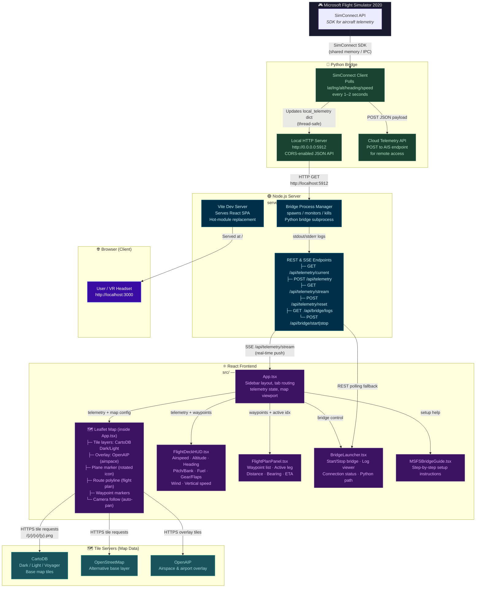
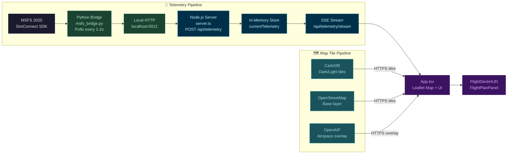
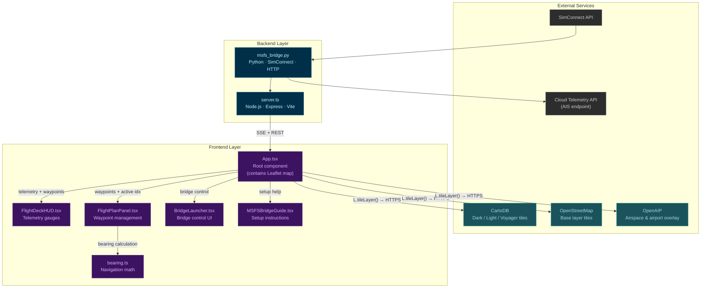
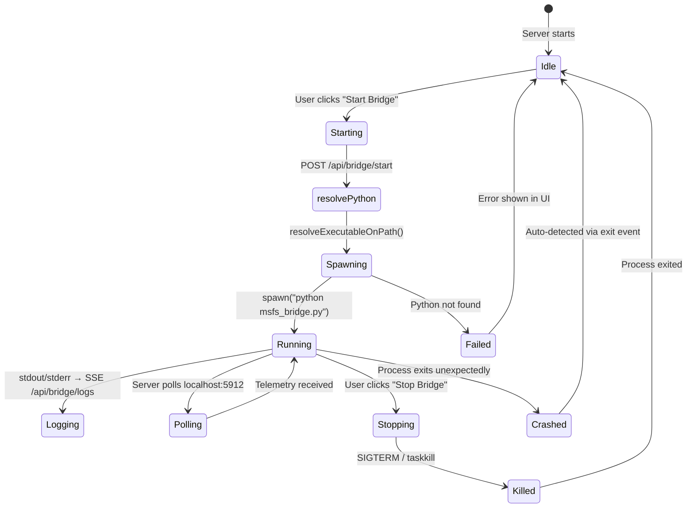
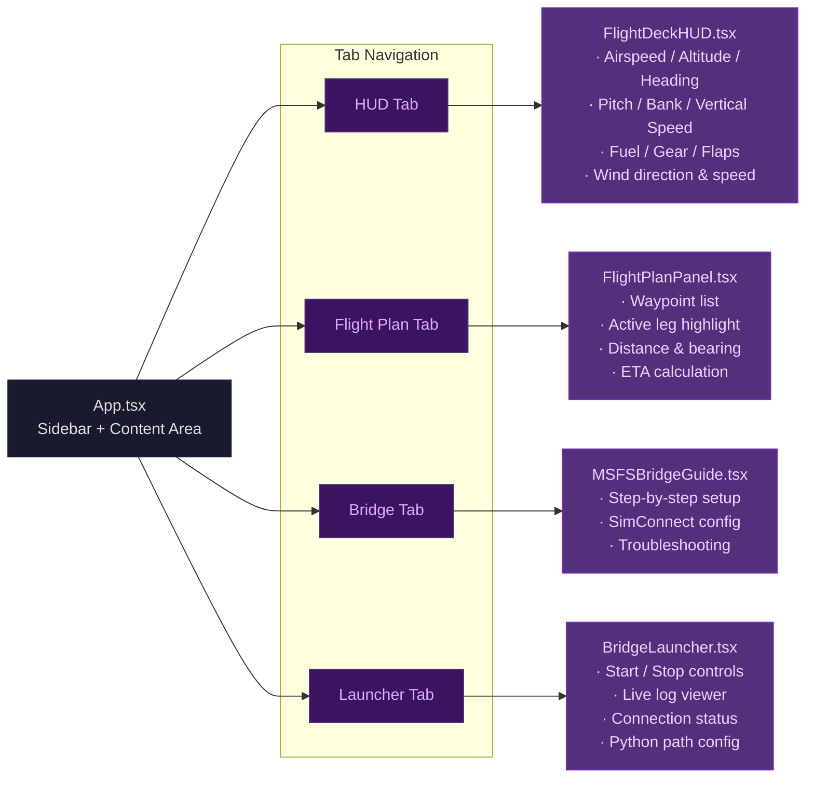
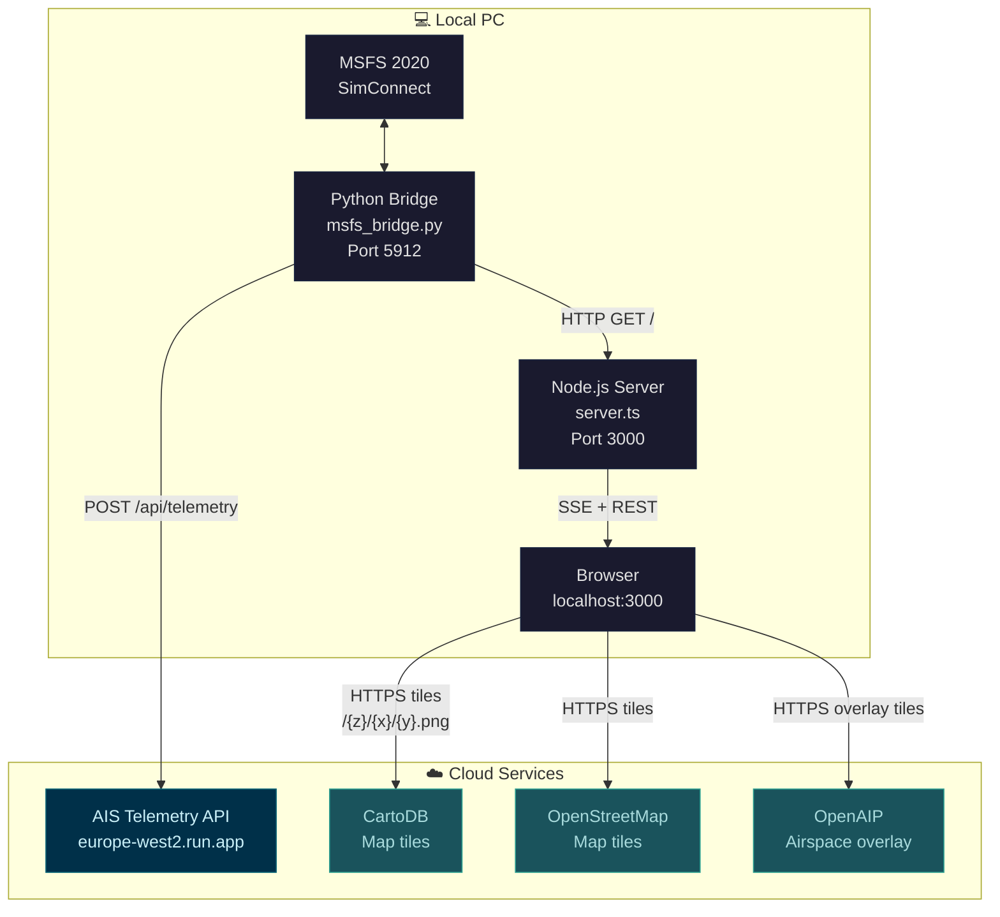

# MSFS VR Flight Map — Architecture Overview

## System Architecture

The map is rendered by **Leaflet** (embedded directly in `App.tsx`) using **raster tile layers** fetched from online tile servers (CartoDB Dark/Light, OpenStreetMap, OpenAIP). Telemetry data flows from MSFS through the Python bridge to the Node server, which pushes it to the frontend via SSE — the Leaflet map then updates the plane marker, route polyline, and camera position in real time.

## Data Flow — Telemetry + Map Tiles

There are **two independent data pipelines** feeding the frontend:

1. **Telemetry pipeline** (blue) — aircraft position, speed, heading, etc. flows from MSFS through the bridge to the server and into the React app.
2. **Map tile pipeline** (green) — the Leaflet map fetches raster tiles directly from online tile servers (CartoDB, OpenStreetMap, OpenAIP) in the browser.

## Component Dependency Map

## Bridge Process Lifecycle

## Frontend Tab Structure

## Network Topology

## Key Ports & Endpoints

| Component | Port / URL | Protocol | Purpose |
|-----------|-----------|----------|---------|
| Python Bridge | `localhost:5912` | HTTP | CORS JSON API for telemetry |
| Node.js Server | `localhost:3000` | HTTP + SSE | REST API + real-time stream |
| SimConnect | Shared memory | IPC | MSFS ↔ Python telemetry |
| Cloud API | `europe-west2.run.app` | HTTPS | Remote telemetry relay |

### REST Endpoints

| Method | Path | Description |
|--------|------|-------------|
| `GET` | `/api/telemetry/current` | Latest telemetry snapshot |
| `POST` | `/api/telemetry` | Submit new telemetry |
| `GET` | `/api/telemetry/stream` | SSE real-time stream |
| `POST` | `/api/telemetry/reset` | Clear telemetry session |
| `GET` | `/api/bridge/logs` | SSE bridge log stream |
| `POST` | `/api/bridge/start` | Launch Python bridge |
| `POST` | `/api/bridge/stop` | Terminate Python bridge |
